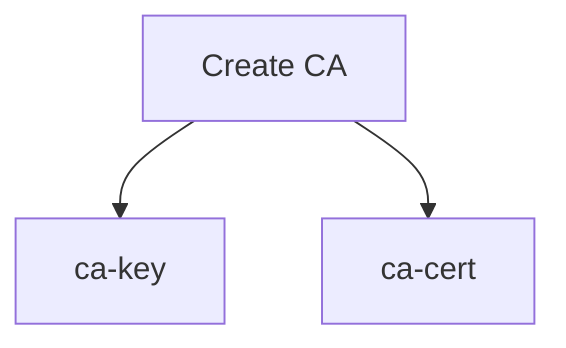
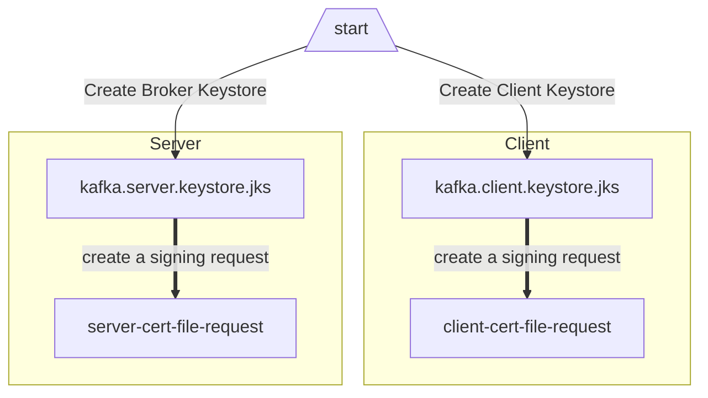
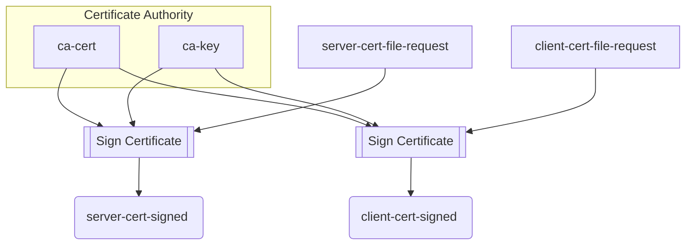
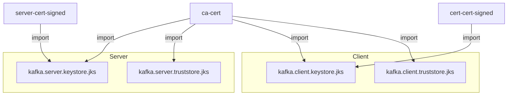

# TLS/mTLS Configuration of Apache Kafka - SELF SIGNING FLOW
## This is a step by step guide to integrate SSL/mTLS authentication for Kafka's Clients and Brokers.


# Download Apache Kafka
curl -O https://downloads.apache.org/kafka/3.2.3/kafka_2.13-3.2.3.tgz


# Generate CA
- ca-cert = public CA certificate
- ca-key = private key of the ca-cert



# Create a Keystore and Create a Cert Sign Request



# Sign Certificate


# Import Certificates


# Commands to generate SSL Certificates
Create a directory `ssl` in your `KAFKA_HOME` directory and generate all the SSL certificates in this directory and set the path as a relative path in the server's and client's properties files as mentioned below.
## First generate Certificate Authority(CA), Truststore and Keystore
Generate CA
```bash
openssl req -new -x509 -keyout ca-key -out ca-cert -days 3650
```

Create Truststore
```bash 
keytool -keystore kafka.server.truststore.jks -alias ca-cert -import -file ca-cert
```

Create Keystore
<br/>
`NOTE:` When you are asked to enter `FULL NAME` you must enter `hostname/dns`(in this example 'localhost').
```bash 
keytool -keystore kafka.server.keystore.jks -alias server -validity 3650 -genkey -keyalg RSA -ext SAN=dns:localhost
```

Create certificate signing request (CSR)
```bash 
keytool -keystore kafka.server.keystore.jks -alias server -certreq -file ca-request-server
```

Sign the CSR
```bash 
openssl x509 -req -CA ca-cert -CAkey ca-key -in ca-request-server -out ca-signed-server -days 3650 -CAcreateserial
```

Import the CA into Keystore
```bash 
keytool -keystore kafka.server.keystore.jks -alias ca-cert -import -file ca-cert
```

Import the signed certificate from step 5 into Keystore
```bash 
keytool -keystore kafka.server.keystore.jks -alias server -import -file ca-signed-server
```

`To generate keystore and truststore for client repeate above steps from 2-7, just replace 'server' with 'client'`.
<br/>


## Secondly create PEM files.
Generally we don't need PEM files for SSL authentication, when we manually produce message from terminal using producer.
Now that you have already generated the SSL/TLS certificates and key stores using your CA, you can use OpenSSL to extract the required files from the CA and SSL/TLS certificates:
<br/>

Extract the public key and certificate of the CA that signed the SSL/TLS certificates to a CARoot.pem file:
```bash
openssl x509 -in ca-cert -out CARoot.pem -outform PEM
```
This will extract the public key and certificate of the CA that signed the SSL/TLS certificates to a CARoot.pem file.

<br/>

Extract the public key and certificate of the SSL/TLS certificate to a certificate_root.pem file:
```bash
openssl x509 -in ca-signed-server -out certificate_root.pem -outform PEM
```
This will extract the public key and certificate of the server SSL/TLS certificate to a certificate_root.pem file. If you have multiple SSL/TLS certificates, you should repeat this step for each certificate.

<br/>

Export the private key and certificate from the keystore to a PKCS12 file:
```bash 
keytool -importkeystore -srckeystore kafka.server.keystore.jks -destkeystore kafka.server.keystore.p12 -srcstoretype jks -deststoretype pkcs12
```
<br/>

Extract the private key from the PKCS12 file to a key_root.pem file:
```bash 
openssl pkcs12 -in kafka.server.keystore.p12 -nocerts -nodes -out key_root.pem
```
`NOTE: A direct way to crete key_root.pem could be this in some articles:`
```bash
openssl pkcs12 -in kafka.server.keystore.jks -nocerts -nodes -out key_root.pem
```
This will extract the private key of the server SSL/TLS certificate to a key_root.pem file. 
<br/>

But this could give you error like:
```properties
"139662461437760:error:0D07207B:asn1 encoding routines:ASN1_get_object:header too long:crypto/asn1/asn1_lib.c:101:"
```
So better use the steps 3 and 4 to genaret key_root.pem.
<br/>

## To Open and Check your Keystore and Truststore certificates.
```bash
keytool -list -v -keystore kafka.server.keystore.jks
```

## Check and verify the CN(Common Name) that you set.
The common name (CN) must match exactly the fully qualified domain name (FQDN) of the server. The client compares the CN with the DNS domain name to ensure that it is indeed connecting to the desired server, not a malicious one. The hostname of the server can also be specified in the Subject Alternative Name (SAN). Since the distinguished name is used as the server principal when SSL is used as the inter-broker security protocol, it is useful to have hostname as a SAN rather than the CN.

To show the CN or SAN in a signed certificate, run the command below:
```bash
openssl x509 -noout -subject -in ca-signed-server
```


# Broker Configuration
Open `server.properties` file in your `KAFKA_HOME/config` and add these configurations to this file.
## server.properties
```properties
listeners=PLAINTEXT://0.0.0.0:9092,SSL://0.0.0.0:9093
advertised.listeners=PLAINTEXT://<HOSTNAME>:9092,SSL://<HOSTNAME>:9093

ssl.keystore.location=<path>/kafka.server.keystore.jks
ssl.keystore.password=yourpassword
ssl.key.password=yourpassword
ssl.truststore.location=<path>/kafka.server.truststore.jks
ssl.truststore.password=yourpassword

ssl.client.auth=required

```

## Verify the SSL port
```bash
openssl s_client -connect <HOST_IP>:9093
```


# Client Configuration
Create a `client.properties` file in your `KAFKA_HOME/config` directory and add these configuration to `client.properties` file.
## client.properties

```properties
security.protocol=SSL
ssl.truststore.location=<path to your truststore>
ssl.truststore.password=<the password>
ssl.keystore.location=<path to your keystore>
ssl.keystore.password=<the password>
ssl.key.password=<the password>

ssl.endpoint.identification.algorithm=
```


Host name verification of servers is enabled by default for client connections as well as inter-broker connections to prevent man-in-the-middle attacks. Server host name verification may be disabled by setting ssl.endpoint.identification.algorithm to an empty string. For example,

```properties
ssl.endpoint.identification.algorithm=
```
<br/>

Start Zookeeper
```bash
bin/zookeeper-server-start.sh config/zookeeper.properties
```
<br/>

Start Broker
```bash
bin/kafka-server-start.sh config/server.properties
```
<br/>

See list of all available Topics
```bash
bin/kafka-topics.sh --bootstrap-server HOSTNAME:9093 --list
```
<br/>

Create Topic
```bash
bin/kafka-topics.sh --bootstrap-server HOSTNAME:9093 --create --topic mytopic --partitions 2 --replication-factor 3
```
<br/>

Describe a Topic
```bash
bin/kafka-topics.sh --bootstrap-server HOSTNAME:9093 --describe --topic my-topic
```
If zookeeper is integrated with SSL, `zookeeper.properties` will have a `secureClientPort` property but keep in mind not to remove clientPort property as kafka-topics.sh does not work with SSL integrated ports.
```properties
clientPort=2181
secureClientPort=2182
``` 
<br/>

Send Messages.
```bash
bin/kafka-console-producer.sh --broker-list HOSTNAME:9093 --topic mytopic --producer.config PATH_TO_THE_ABOVE_PROPERTIES
```
Once producer is started, your terminal would allow you to enter messages one by one.
```bash
>Hi kafka!
>
```
<br/>

Start Consumer to Recieve Messages
```bash
bin/kafka-console-consumer.sh --bootstrap-server HOSTNAME:9093 --topic mytopic --consumer.config PATH_TO_THE_ABOVE_PROPERTIES
```
By default consumer reads message from all partions of a topic,but in case not message appears can specify partition 
```bash
bin/kafka-console-consumer.sh --bootstrap-server HOSTNAME:9093 --topic mytopic --consumer.config PATH_TO_THE_ABOVE_PROPERTIES --partition 0
```


